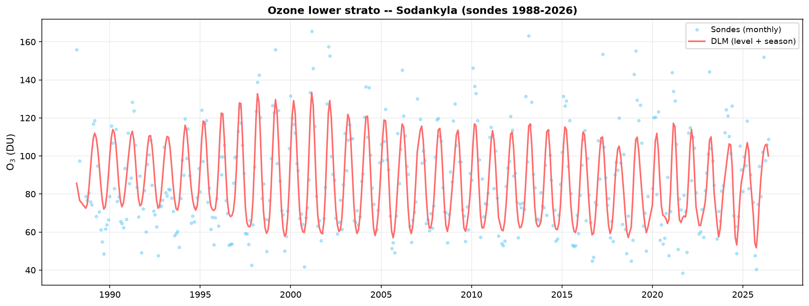
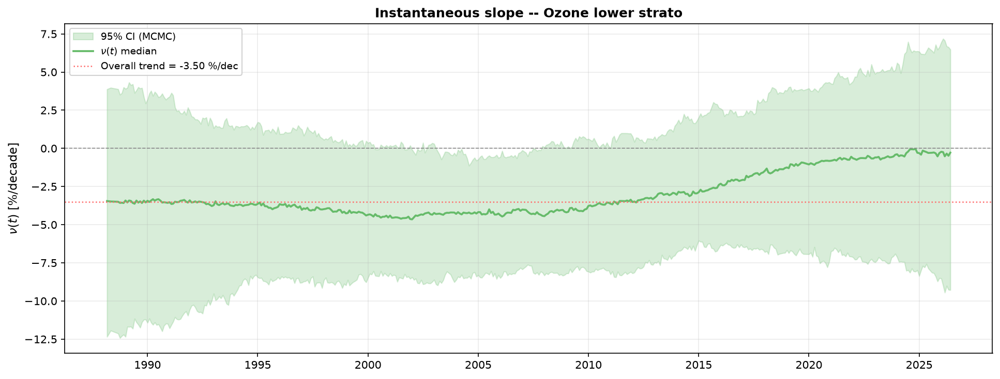

# Ozone DLM Pipeline -- Sodankylä

A Dynamic Linear Model (Kalman filter + RTS smoother + MCMC, following
[Laine et al. 2014](https://doi.org/10.5194/acp-14-9707-2014)) estimating
ozone trends at Sodankylä from WOUDC ozonesonde profiles (1988–2026),
corrected for 13 geophysical proxies (solar cycle, QBO, ENSO, polar vortex,
volcanic aerosols, stratospheric temperature, tropopause height, chlorine
loading...).

Four atmospheric layers are analyzed independently: troposphere (0–8 km),
lower stratosphere (8–17 km), mid-stratosphere (17–26 km), and the total
ozone column (from the sonde's own `SondeTotalO3` integration).

## Requirements

- Python 3.10+
- `numpy`, `pandas`, `scipy`, `matplotlib`
- WOUDC ozonesonde profiles, of your own (not bundled in this repo --
  see [Input data](#input-data) below for how to point the code at them)
- The 13 geophysical proxies are included in `proxy/` (see
  [Proxies](#proxies) below)

## Running the pipeline

```bash
cd dlm
python step6_ozone_dlm.py
```

This runs the full pipeline (all 4 layers, with proxies and the 5-level
validation suite) and writes figures to `../output/`.

### Command-line options

| Flag | Default | Effect |
|---|---|---|
| `--no-proxies` | off | Disable the 13 geophysical proxies (raw trend, level+season+AR(1) model only) |
| `--no-validation` | off | Skip the 5-level validation suite (faster, figures only) |
| `--input-dir DIR` | `../input` | Where to read the WOUDC ozonesonde archives from (see [Input data](#input-data)) |
| `--output-dir DIR` | `../output` | Where to write the figures |
| `--n-mcmc N` | 15000 | Post-burn-in MCMC iterations |
| `--n-burnin N` | 3000 | MCMC burn-in iterations |
| `--n-sim N` | 200 | Simulated trajectories used for the 95% confidence band |
| `--aic-threshold X` | 2.0 | AIC gain threshold to keep a proxy in the stepwise selection |

Example -- quick run without proxies or validation, in its own folder:
```bash
python step6_ozone_dlm.py --no-proxies --no-validation --output-dir ../output/no_proxy
```

## What you get

For each of the 4 layers, two figures:

- `dlm_o3_{layer}.png` -- monthly sonde data (points) with the smoothed DLM
  fit (level + seasonal harmonics).
- `dlm_o3_{layer}_slope.png` -- the instantaneous trend $\nu(t)$ in %/decade
  over time, with its 95% MCMC confidence band.

Plus one summary figure comparing all 4 layers:

- `dlm_o3_comparison_layers.png` -- trend ± 95% CI per layer, colored by
  significance (produced locally, not tracked in this repo).

A printed summary table (trend, CI, p-value, selected proxies per layer)
is also written to stdout.

|  |  |
|---|---|

## Input data

This repo does not bundle the raw WOUDC ozonesonde profiles -- point the
code at wherever you keep them instead. The pipeline expects three
subfolders (the archives that make up the Sodankyla record), each holding
WOUDC extCSV files directly:

| Subfolder | Coverage | Profiles |
|---|---|---|
| `<input-dir>/89-94/woudc/` | 1989--1994 | 382 |
| `<input-dir>/94-24/woudc/` | 1994--2024 | 1510 |
| `<input-dir>/24-26/woudc/` | 2024--2026 | 70 |

Two ways to set `<input-dir>`:

- Command line: `python step6_ozone_dlm.py --input-dir /path/to/your/data`
- Code default: edit `INPUT_DIR` at the top of `dlm/step6_ozone_dlm.py`
  (defaults to `../input` relative to the `dlm/` folder)

`load_sonde_data()` reads all three subfolders and deduplicates dates that
overlap at the archive boundaries.

## Proxies

The `proxy/` folder contains the 13 geophysical proxy time series used by
the model (solar cycle, QBO, ENSO, AO, EHF, SAOD, stratospheric
temperatures, EESC, VPSC, tropopause height...). They are loaded and
standardized by `load_proxies()` in `dlm/step6_ozone_dlm.py`.

**Adding a new proxy is not automatic.** Dropping a new file into `proxy/`
has no effect by itself -- each proxy is loaded by an explicit line inside
`load_proxies()` (e.g. `df["Solar"] = _load_csv_series("mgii.csv", 0,
monthly_idx)`). To add a proxy, two edits are needed in
`dlm/step6_ozone_dlm.py`:

1. Add a loading line for it inside `load_proxies()`.
2. Add its column name to the `PROXY_CANDIDATES` list, so the stepwise AIC
   selection (`select_proxies()`) actually considers it.

## Pipeline structure

| File | Role |
|---|---|
| `dlm/step1_ssm_matrices.py` | State-space model matrices (G, F, Q, R) |
| `dlm/step2_kalman_filter.py` | Forward Kalman filter |
| `dlm/step3_rts_smoother.py` | Backward RTS smoother |
| `dlm/step4_simulation_smoother.py` | Carter-Kohn simulation smoother (trajectory sampling) |
| `dlm/step5_mcmc.py` | Adaptive Metropolis MCMC for hyperparameters |
| `dlm/verif_modele.py` | 5-level validation suite |
| `dlm/step6_ozone_dlm.py` | Orchestration: data loading, proxies, AIC selection, plotting, CLI |
